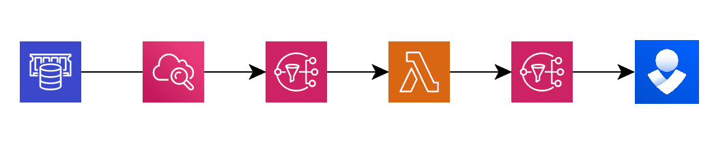
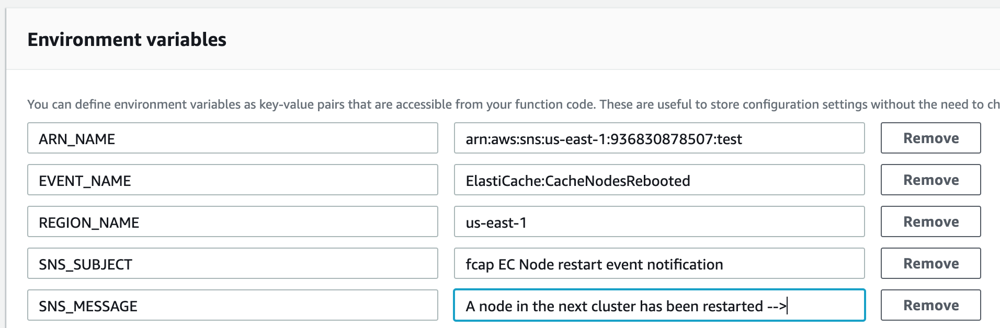

# EC-Node Events to SNS 
   
## How it works

1. First the service send the event notification to SNS.
2. The SNS resend this event to Lambda function.
3. Lambda function parse the data and send this to SNS2.
4. SNS2 send the message to another external service (Mail, Opsgenie, etc).



## Config in AWS Lambda

> Set the environments variables in our function (https://console.aws.amazon.com/lambda/)
>> Example

```python
arn_name = os.environ['ARN_NAME']
region = os.environ['REGION_NAME']
notif = os.environ['EVENT_NAME']
sns_subject = os.environ['SNS_SUBJECT']
sns_message = os.environ['SNS_MESSAGE']
```



**Set Subject and message in sns.publish**

```python
        Subject=sns_subject,
        Message=(sns_message + jParsed)
        # the sns_message env var is concatenated with cluster name (jParsed) 
```

## Config in build.sh script

**Set variables according to your environment**

```bash
PROJECT_NAME=prd-ec-node-events-sns # Lambda name
AWS_REGION=${AWS_REGION:-us-east-1} # AWS Region
AWS_PROFILE=${AWS_PROFILE:-default} # AWS Local profile name
```

**Execute script to build**

```bash
./build.sh
```
